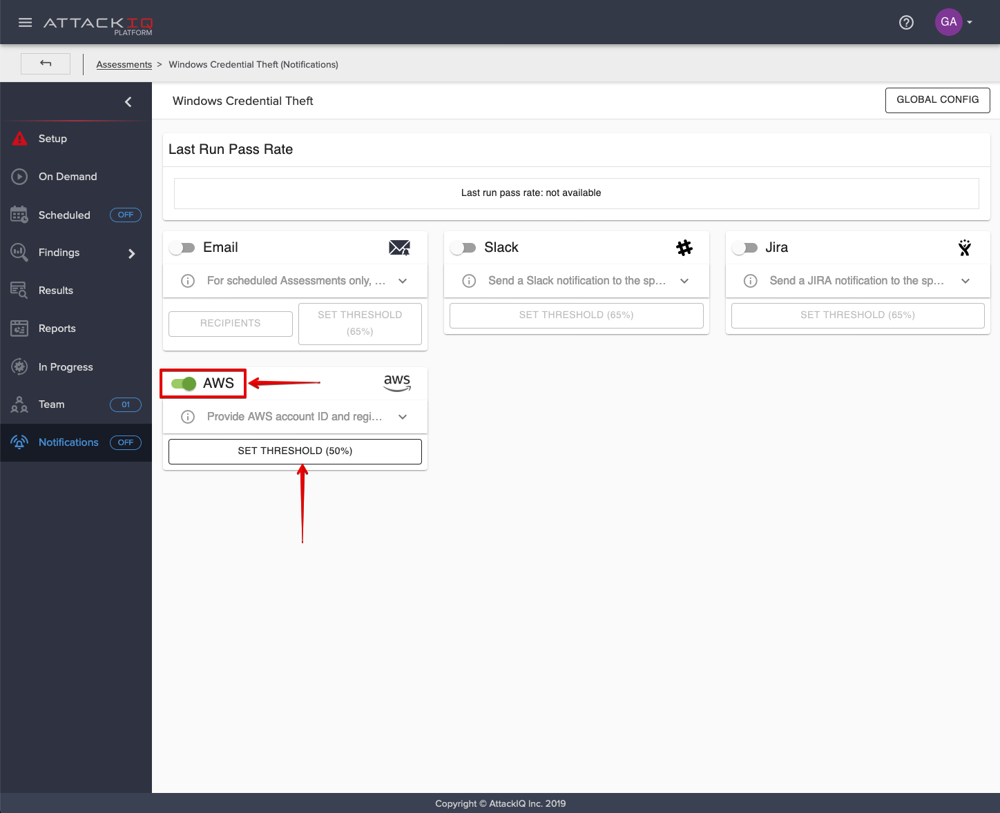
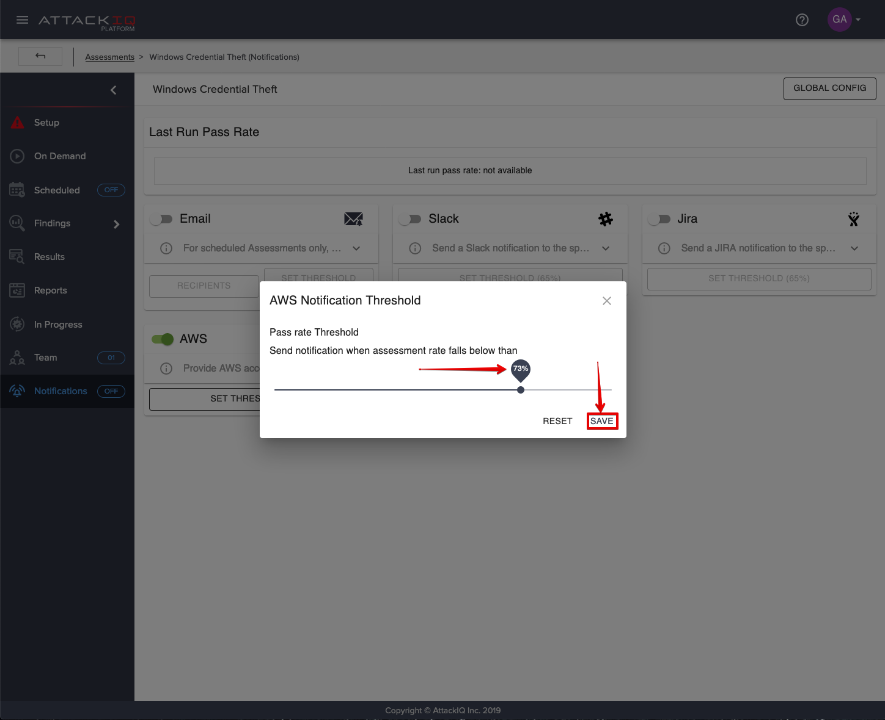

# AttackIQ Platform

Don't have AttackIQ? [Learn more](https://go.attackiq.com/BD-AWS-Security-Hub_LP.html)

## Overview

The AttackIQ Platform provides the capability to send notifications for scheduled assessment results to AWS Security Hub. With this facility, you can set a minimum prevention rate for a scheduled assessment.  When the prevention percentage falls below this threshold, the AttackIQ Platform will send a notification to your Security Hub Console conveying the assessment results.

This guide will show you how to configure the AWS Security Notification facility for your scheduled assessments.

## Configuration

To configure AWS Security Hub notifications, follow this procedure:

<ol start="1"><li>Open your AttackIQ Platform UI then click on the assessment you want to schedule.</li>
</ol>

<ol start="2">
<li>Click on the <b>Scheduled</b> menu item, then schedule your assessment. The details of how this is done will not be covered in this guide.</li>
<li>Click on the <b>Notification</b> menu item.</li>
<li>Click on the <b>Global Config</b> button.</li>
</ol>

<ol start="5">
<li>Click on the AWS <b>Configure</b> button.</li>
</ol>

<ol start="6">
<li>Enter your <b>AWS Account ID</b></li>
<li>Enter your <b>AWS Region</b></li>
<li>Click on the <b>TEST CONNECTION</b> button to send a test notification.
<li>Click on the <b>Update</b> button to save the notification configuration fo your scheduled assessment. 
</ol>

<ol start="10">
<li>Click on the AWS <b>STATUS</b> switch to enable AWS notifications.</li>
</ol>

<ol start="11">
<li>Click on the <b>AWS</b> toggle switch to enable notifications for your assessment.</li>
</ol>

<ol start="12">
<li>Click on the <b>SET THRESHOLD</b> button.</li><li>Set the desired threshold with the slider control.</li>
<li>Click on <b>Save</b> button.</li>
</ol>

## AWS Security Hub Console

To see your Security Hub notifications:

1. Open your **AWS Management Console**
1. Click on **Security Hub** in the **Security, Identity, & Compliance** section.
1. Click on **Findings** in the menu on the left.  
1. Click on the empty part of the search box.
1. Select **Severity label** from the menu.
1. Enter **CRITICAL**.
1. Click on **Apply**.

You should get findings that look like the following.  

In this example, both a test notification and a scheduled assessment notification are shown.